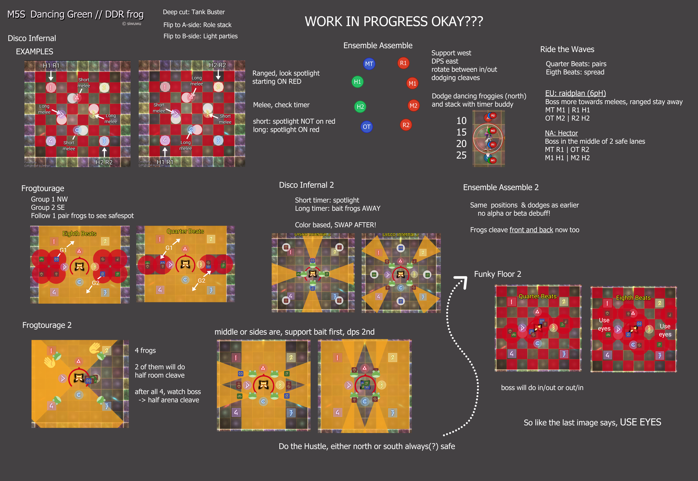
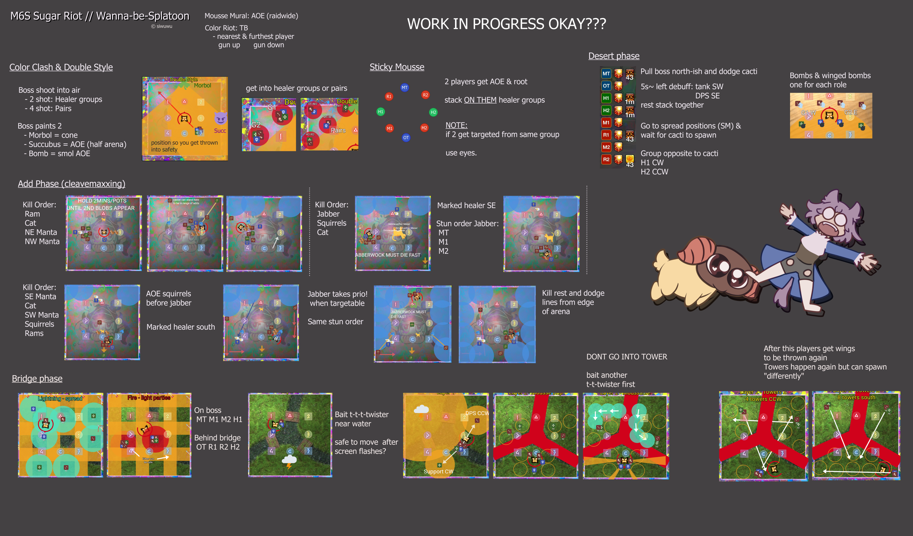

# FFXIV Savage fights - Cheatsheets

FFXIV pelissä Savage raid -taistelut ovat haastavia taisteluita, jotka sisältävät vaihtelevia ja monimutkaisia mekaniikkoja. Näiden muistamisen aluksi kun taisteluita opettelee voi olla hankalaa, etenkin henkilölle joka oppii visuaalisesti.

Tätä varten pelaajat luovat raidplan -https://raidplan.io/ffxiv sivuston avulla diaesityksen, tämän selaaminen on kuitenkin haastavaa etenkin mahdollisesti kesken taistelun.

Ratkaisuna otin kuvakaappauksia tunnetuimmista/käytetyimmistä raidplan -strategioista ja järjestänyt ne yhteen kuvaan mahdollisten lyhyiden mekaniikkaselitysten kera.

Alla on esimerkkejä:

AAC Light-heavyweight M4 (Savage)

Wicked Thunder bossi on jaettu kahteen osaan, koska se on kyseisen tierin viimeinen bossi, joka on yleisimmin vaikein ja tämän taistelun harjoittelu kestää yleensä kaikista eniten. Tätä varten part 1 ja part 2 on jaettu kahteen osaan, koska kaikki eivät välttämättä tarvitse part 1 osaa koska ovat alkaneet muistaa mekaniikat jo ulkoa.

AAC Cruiserweight M1 (Savage)

AAC Cruiserweight M2 (Savage)
