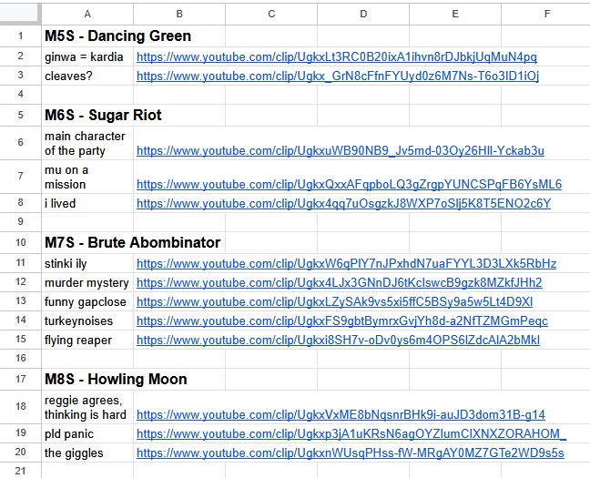

# Vote the Funny

FFXIV pelaajaryhmästä yksi striimaa pelisessioita ja olen saanut kunnian klipata hauskimpia hetkiä pelihetkistämme. Tätä varten nyt kun kyseinen Savage tier lähestyy loppuaan ja nähtyäni kuinka paljon klippejä on olemassa, tuli ideaksi tehdä "Hauskimmat palat" tyyppinen video.

Sain oikeudet kaverin Youtube kanavalle ja aloin tutkia kuinka monta klippiä on olemassa. Yli 100 kpl joten piti keksiä miten järjestän äänestyksen. Aloitin projektin ensin järjestämällä klipit Google Sheets- pohjalle, mikä raidboss oli kyseessä, klipin nimi ja linkki.

Testausta varten valitsin vain muutamat ja järjestelin ne omaan välilehteensä.

Tutkin asiaa ja päädyin tekemään Google Forms, joka lukee datan kyseisestä Google Sheets:tä. Tavoitteena tehdä: 
- helppo äänestys (ei pakollista google tilille kirjautumista)
- jaotella klipit kyseisen raidbossin mukaan
- mahdollisuus äänestää montaa klippiä
- kerätä data mahd. helposti

Itse skriptin pääsee lukemaan Apps -skripti tiedostosta. Tiedostoon on liitetty kommentteja selittämään itselle mitä missäkin kohdassa tapahtuu.

Äänestyksen testausta ja vastauksien tarkastelua

